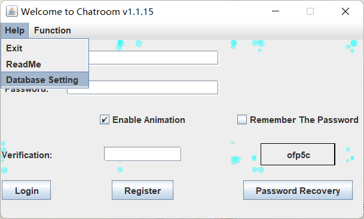
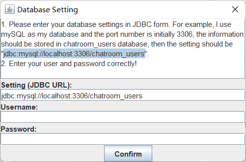

# README

Last Updated: 2023.4.17

**If you are the course TA and need to grade this project, please skip my nonsence here and jump to "Get Started".**

This is a Java Project for CUHK-SZ Year-1 Course CSC1004. It takes 60% of all assessment scheme. For more information, please visit [Course Website](https://guiliang.github.io/courses/cuhk-csc-1004/csc_1004.html) and [Project Requirements](https://guiliang.github.io/courses/cuhk-csc-1004/project-topics/chat_room.html). This project was finished **in April 2023, if you see this project after 2023, all code here cannot speak for my coding skills!**

This Project implements a Java Chatroom that can support multi-user chatting. However, this is just a toy example and poor imitation of a real chatroom and can only run on one's own laptop and currently don't have a cloud server. So it cannot serve any real-world purpose.

All code are open-sourced with as-much-as-possible-user-friendly comments. Most of the code are self-explained.

All code were written in Java. The GUI was written in Java AWT and Java Swing. The knowledge involved also includes Java Socket Programming, JDBC (Java + mySQL), IOStream, multi-thread Programming and so on. Solid Java SE knowledge is also expected in many details like Collection.

The most tricky part in my mind was the IOstream because there're too many of them and I also had to combine them with Socket Programming and Network Knowledge. Some day I spent six hours on the messaging function but finally in vain... It took me around 100-120 hours to finish (including reviewing Java Socket Programming knowledge) this sixty-percent-of-one-unit project.

## Assessment / Function List

See [here](https://guiliang.github.io/courses/cuhk-csc-1004/csc-1004-marking-rules.html).

##### Common Grading (20 pts)

- [x] Code Documention 5 pts 
- [x] Video 5 pts
- [x] Tutorial for Running 5 pts
- [x] Can run 5 tps

##### Multi-Client Chat

1. Multi-Client Chat (20pts)
   1. (8pts) A server that could support multiple clients to communicate with each other
   2. (8pts) Could generate multiple clients to work together.
   3. (4pts) The clients could send and receive messages simultaneously. (The basic function of a group chat app works well.)
2. Login System (20pts)
   1. (5pts) Having a database to record user information.
   2. (4pts) The database works well when the login system visits the database for information.
   3. (4pts) A login system that could receive the inputs (e.g., usernames, passwords).
   4. (4pts) The login system could verify the combination of Username and Password.
   5. (3pts) The login system runs smoothly. We could start to chat after logging into the system.
3. Java GUI (20pts)
   1. (10pts) A GUI for the client (5pts) and A GUI for the login System(5pts).
   2. (4pts) Buttons(1pts) and the buttons work well (3pts).
   3. (4pts) Text fields (1pts) and they work well(3pts).
   4. (2pts) The designs are user-friendly.
4. Advanced Features (20pts)
   1. Registration System (5 pts)
   2. Emoji (5 pts)
   3. Sending Pictures (5 pts)
   4. Message History (5 pts)
   5. Animation (<5 pts) I've implemented the login & Registration animation, but failed in Chatroom window... If partial points would be given I'll be appreciative because the first two already took much much time. But I think I've accomplished the first four, which should be enough.
   6. Password Recovery (no point hereafter). You could input your Username, Email , Old Password and Security Questions you set when signed up to recover your forgotten password!
   7. Verification Code. Clients are required to input a verification code to prevent someone from using brutal password force attack.
   8. Remember the password. If you ticked the checkbox and login, you can avoid inputting your password again and again on your computer.
   9. Look up and Update your profile. After login, you could feel free to update your personal information, which will be recorded by the database, too.

## Get Started

Let's see how the project is implemented.

If you're trying to run the project on your own computer, you should set up your database first!

First, click on Database Setting. You should copy the setting for now because the application doesn't support other databases.

The URL should be modified only when the port number is not by default 3306. Then input your mySQL username and password.

Make sure you **don't** have a database called "chatroom_users" now!

Look at the Project Structure, the main code are divided into three parts. You should know click on setting/Init_Database, and run the main method directly. The database and tables needed are prepared automatically.

The other two runnable programs are "client/Client" and "server/Server". Please run them.

The server doesn't have a GUI and logs will be outputed in the system console. You don't need to understand them in order to use this application.

The client side should look like this.

There's a stupid animation here I used to fill the assessment scheme in the past. You can turn it off with the "Enable Animation".

The GUI is self-explanatory.

The Register Window also has the stupid animation, which I'm too lazy to set a checkbox to close.

Please follow the instructions to fill out the form in order to sign up. After registering successfully, your data will be stored in your database so that you can directly login after this time.

Note that if you want to recovery your password one day, you should remember your username, e-mail carefully! Additionally, you should fill in **at least one** question to secure your account. The '\*' items are not required, though. Here's a sample of Successful Signing Up. If you click and nothing happens, you may have too many windows on your desktop, you can search for the sign-up information dialog.

Then you should enter your username and password, you can also tick the "Remember The Password" to avoid entering them next time.

If you stumble over the Verification code for "I1l" issue, you can click right on it to change one. The code is not case-sensitive.

Now you should enter this GUI!

## Multi-Client Chat

To generate multiple users to simulate multi-client chat, you can click on "New User Login" to arouse another login window, you can login with another user. **Don't use** your current user! This will cause confusion when chatting (you cannot get yourself while Getting Online Friends).

*update: The confusion here is solved in the newest version. If you have logged in, you'll be banned from logging with the same user!*

The login window may be hidden behind your Chatroom window.

Now you should have two users online!

Click on both sides' "Get online Friends", and you should have each other on the list. You should click to update the list whenever you are about to say something to your friend, because they may already be offline!

Click on the friend you want to chat with, and then you should see both your name and your friend's name on the top corners.

Now you should send what you want with your friends! If you type some text messages, use Ctrl/Command + Enter should also work!

## Other Functions

###### Sending Pictures and Files

Use the "Files" button to choose an image.

The files function will do for all kinds of files. Folders are not supported currently. You can compress it into a zip/rar file, though.

If you send a picture (image files, jpg/jpeg/gif/bmp/tif/tiff), both you and the receiver can see the pictures on the screen and the receiver will get a reminder asking him/her whether he/she wants the file to be saved. Since Files, including Images **will not be recorded by the history** function, you should save the file if necessary, you cannot save the image after this chance, either!

###### Message History

Your conversation with another user will be faithfully recorded even after you exit because they are stored in the database.

Note that emoji and files will not be recorded. The former is not important (I think) and the latter one is technically hard to maintain in databases. I'll try to improve this in the future if possible.

###### Actions Menu

"New User Login" will arouse another login window except the current one as I've mentioned before. Meanwhile "Login with another user" will exit the current user and arouse the new login window.

"Update Profile" item can update your information easily. This, for sure, will be recorded by the database.

"Add a new emoji" allows you to add whatever you like in the emoji set. Of course only images are allowed. The emojis are in reality stored in resources/emoji folder, the GUI doesn't support deleting currently. If you want, go to that folder.

Other functions are self-explanatory in my opinion. If you have any issues/questions/suggestions about this readme file/my code/my application, feel free to contact me!