# README

Last Updated: 2023.5.4

**If you are the course TA and need to grade this project, please skip my nonsence in the introduction and jump to "Getting Started".**

# Table of Contents

1. [README](#readme)
2. [Introduction](#introduction)
3. [Assessment / Function List](#assessment--function-list)
4. [Tutorials](#getting-started)
   1. [Getting Started](#getting-started)
   2. [Multi-Client Chat](#multi-client-chat)
   3. [Other Functions](#other-functions)
      1. [Sending Pictures and Files](#sending-pictures-and-files)
      2. [Message History](#message-history)
      3. [Actions Menu](#actions-menu)

5. [Techniques Details Explained and Reflections](#techniques-details-explained-and-reflections)

## Introduction

This is a Java project for the CUHK-SZ Year-1 course, **CSC1004**. It accounts for 60% of the overall assessment. For more information, please visit [Course Website](https://guiliang.github.io/courses/cuhk-csc-1004/csc_1004.html) and [Project Requirements](https://guiliang.github.io/courses/cuhk-csc-1004/project-topics/chat_room.html). This project was completed in April 2023, so if you're viewing it after that time, **please note that the code may not reflect my current coding skills**!

This project implements a Java Chatroom that can support multi-user chatting. However, it's just a basic example and not a fully-functioning chatroom, as it can only run on a local machine and doesn't have cloud server support. So, it's not suitable for real-world use yet.

The code is open-source and comes with user-friendly comments as much as possible. Most of the code is self-explanatory.

All code was written in Java, with the GUI developed using Java AWT and Java Swing. The project also involves Java Socket Programming, JDBC (Java + MySQL), IOStream, multi-thread programming, and other Java SE knowledge like Collections.

The most challenging part for me was IOStream, as there are many types to manage and I had to combine them with Socket Programming and Networking knowledge. One day I spent six hours on the messaging function without success... It took me around 50-60 hours to complete this project, which represents sixty percent of one course unit (including reviewing Java Socket Programming knowledge and stuff like writing this README or recording the video).

For more detailed explanations about the code, please refer to the last part of this README.

If you're a future CUHKSZ student taking CSC1004 and need help with this project, feel free to contact me through the school email or any other way.

ID: 122090180

Points gotten in this project: ? / 100

## Assessment / Function List

See [here](https://guiliang.github.io/courses/cuhk-csc-1004/csc-1004-marking-rules.html).

##### Common Grading (20 pts)

- [x] Code Documention 5 pts 
- [x] Video 5 pts
- [x] Tutorial for Running 5 pts
- [x] Can run 5 tps

##### Multi-Client Chat

1. Multi-Client Chat (20pts)
   1. (8pts) A server that could support multiple clients to communicate with each other
   2. (8pts) Could generate multiple clients to work together.
   3. (4pts) The clients could send and receive messages simultaneously. (The basic function of a group chat app works well.)
2. Login System (20pts)
   1. (5pts) Having a database to record user information.
   2. (4pts) The database works well when the login system visits the database for information.
   3. (4pts) A login system that could receive the inputs (e.g., usernames, passwords).
   4. (4pts) The login system could verify the combination of Username and Password.
   5. (3pts) The login system runs smoothly. We could start to chat after logging into the system.
3. Java GUI (20pts)
   1. (10pts) A GUI for the client (5pts) and A GUI for the login System(5pts).
   2. (4pts) Buttons(1pts) and the buttons work well (3pts).
   3. (4pts) Text fields (1pts) and they work well(3pts).
   4. (2pts) The designs are user-friendly.
4. Advanced Features (20pts)
   1. Registration System (5 pts)
   2. Emoji (5 pts)
   3. Sending Pictures (5 pts)
   4. Message History (5 pts)
   5. Animation (<5 pts) I've implemented the login & Registration animation, but failed in Chatroom window... If partial points would be given I'll be appreciative because the first two already took much much time. But I think I've accomplished the first four, which should be enough.
   6. Password Recovery (no point hereafter). You could input your Username, Email , Old Password and Security Questions you set when signed up to recover your forgotten password!
   7. Verification Code. Clients are required to input a verification code to prevent someone from using brutal password force attack.
   8. Remember the password. If you ticked the checkbox and login, you can avoid inputting your password again and again on your computer.
   9. Look up and Update your profile. After login, you could feel free to update your personal information, which will be recorded by the database, too.

## Getting Started

*Update 23/4/19: The video tutorial is uploaded and you can see it in the resources folder.*

*Update 23/4/19: The Bi-weekly report, which accounts for 10% of the assessment, has also been uploaded for reference. I didn't actually stick to the schedule I made in the first week. Plans change, don't they?*

Let's take a look at how the project is implemented.

If you want to run the project on your own computer, you need to set up your database first!

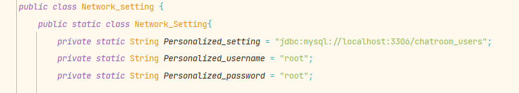

Goto the Network_setting.java, find the code shown above, and replace the username and password with yours!

You do not need to modify the setting string. You should have **mysql 8.0** or above, if your version number is "5.x", you may have to modify 3306 with 13306, notice that you should modify the 3306 in the DatabaseInitializer in this class, too!

Now, please run "Init_Database.java" before you launch the client and server side.

~~Make sure you **don't** have a database called "chatroom_users" now!~~

*Update 23/5/4: The Init_Database process is updated and now it's easier to use. It will automatically drop the database "chatroom_users" such that it's easier to test the code. Meanwhile, the bug that failing the connection when you test on your own computer is fixed.* 

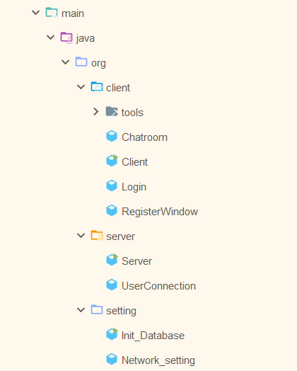

Look at the Project Structure, the main code are divided into three parts.

The other two runnable programs are "client/Client" and "server/Server". Please run them.

The server doesn't have a GUI and logs will be outputed in the system console. You don't need to understand them in order to use this application.

The client side should look like this. **If this window is successfully launched, it means your database setting is correct**, otherwise, please update your database setting with the instructions above.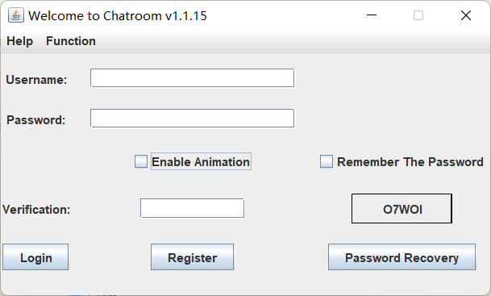

There's a stupid animation here I used to fill the assessment scheme in the past. You can turn it off with the "Enable Animation".

The GUI is self-explanatory.

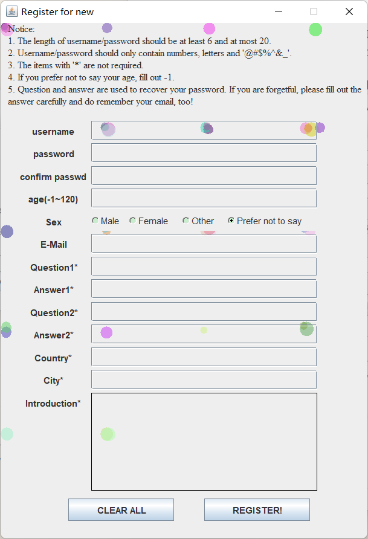

The Register Window also has the stupid animation, which I'm too lazy to set a checkbox to close.

Please follow the instructions to fill out the form in order to sign up. After registering successfully, your data will be stored in your database so that you can directly login after this time.

Note that if you want to recovery your password one day, you should remember your username, e-mail carefully! Additionally, you should fill in **at least one** question to secure your account. The '\*' items are not required, though. Here's a sample of Successful Signing Up. If you click and nothing happens, you may have too many windows on your desktop, you can search for the sign-up information dialog.

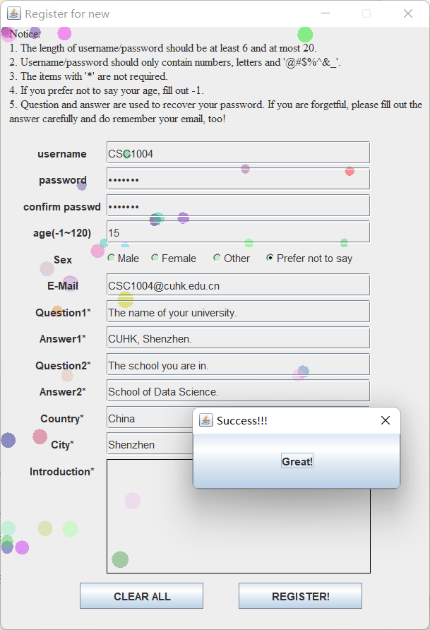

Then you should enter your username and password, you can also tick the "Remember The Password" to avoid entering them next time.

If you stumble over the Verification code for "I1l" issue, you can click right on it to change one. The code is not case-sensitive.

Now you should enter this GUI!

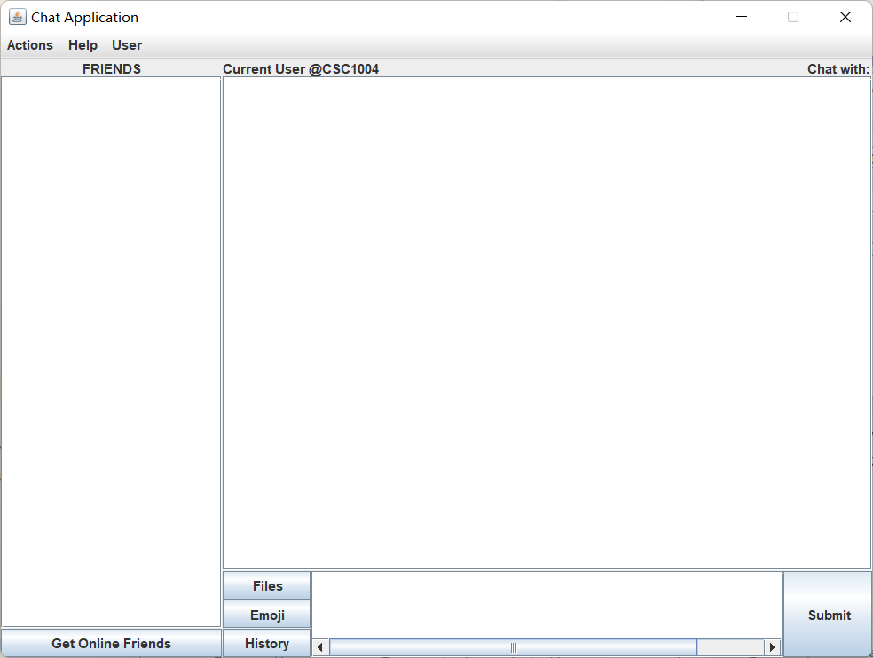

## Multi-Client Chat

To generate multiple users to simulate multi-client chat, you can click on "New User Login" to arouse another login window, you can login with another user. **Don't use** your current user! This will cause confusion when chatting (you cannot get yourself while Getting Online Friends).

*update 23.4.19: The confusion here is solved in the newest version. If you have logged in, you'll be banned from logging with the same user!*

The login window may be hidden behind your Chatroom window.

Now you should have two users online!

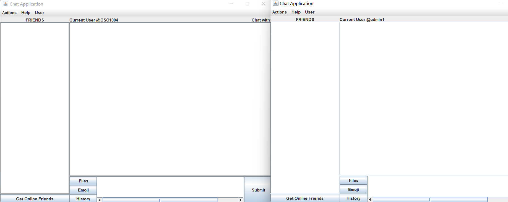

Click on both sides' "Get online Friends", and you should have each other on the list. You should click to update the list whenever you are about to say something to your friend, because they may already be offline!

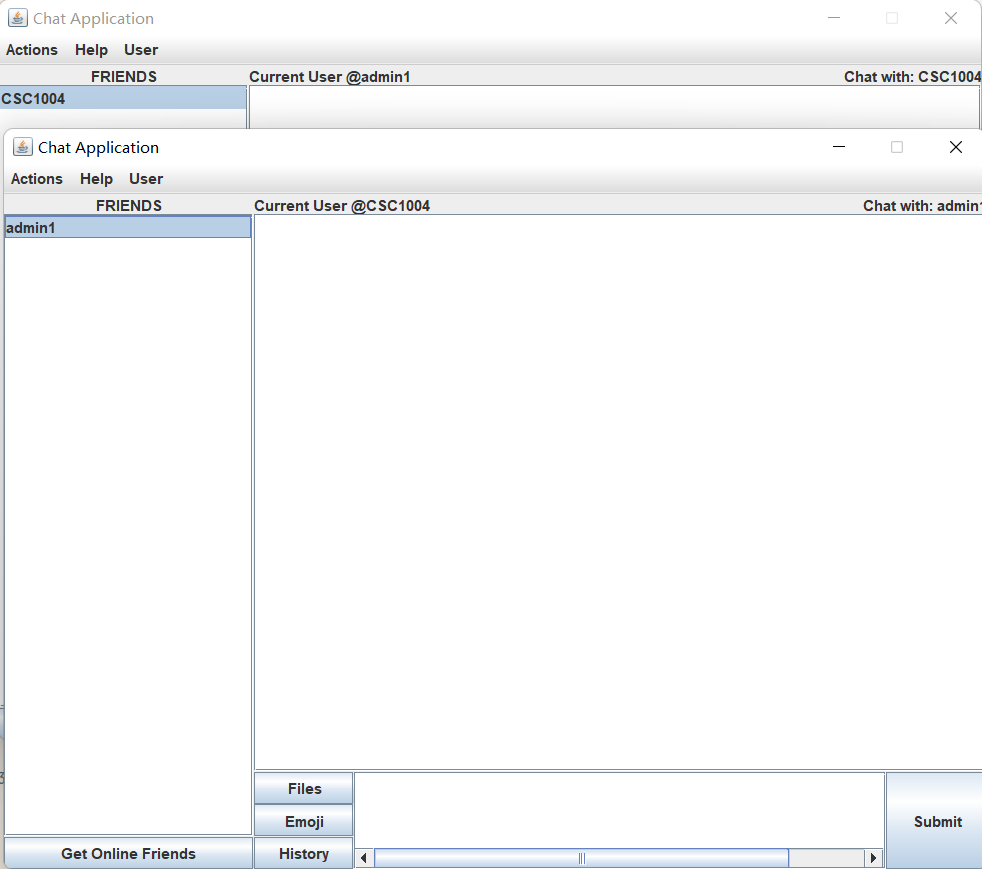

Click on the friend you want to chat with, and then you should see both your name and your friend's name on the top corners.

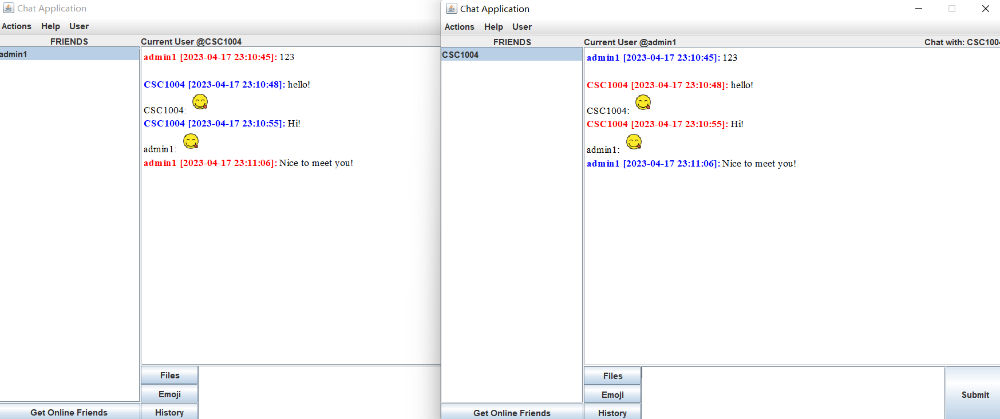

Now you should send what you want with your friends! If you type some text messages, use Ctrl/Command + Enter should also work!

## Other Functions

#### Sending Pictures and Files

Use the "Files" button to choose an image.

The files function will do for all kinds of files. Folders are not supported currently. You can compress it into a zip/rar file, though.

If you send a picture (image files, jpg/jpeg/gif/bmp/tif/tiff), both you and the receiver can see the pictures on the screen and the receiver will get a reminder asking him/her whether he/she wants the file to be saved. Since Files, including Images **will not be recorded by the history** function, you should save the file if necessary, you cannot save the image after this chance, either!

Currently if you save a file that has identical name with another file, it WILL cover the other one!

#### Message History

Your conversation with another user will be faithfully recorded even after you exit because they are stored in the database.

Note that emoji and files will not be recorded. The former is not important (I think) and the latter one is technically hard to maintain in databases. I'll try to improve this in the future if possible.

#### Actions Menu

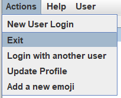

"New User Login" will arouse another login window except the current one as I've mentioned before. Meanwhile "Login with another user" will exit the current user and arouse the new login window.

"Update Profile" item can update your information easily. This, for sure, will be recorded by the database.

"Add a new emoji" allows you to add whatever you like in the emoji set. Of course only images are allowed. The emojis are in reality stored in resources/emoji folder, the GUI doesn't support deleting currently. If you want, go to that folder.

## Techniques Details Explained and Reflections

In this section, I'll provide a brief overview of how my code works in this project.

Let's start by examining the source code structure: 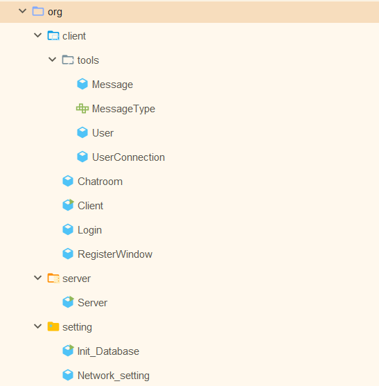 

The two classes in the setting package are introduced in the usage tutorial. Their purpose is to ensure that the project runs on any computer equipped with MySQL. They don't serve any other purpose.

The tools package contains several classes and interfaces used in the application.

Message and MessageType are the most important. They represent a protocol that the client and server sides agree upon when sending messages. The Message class is serializable and can be transmitted using the IO stream writeObject() method while carrying any information we want to send to the other side. MessageType indicates the type of message being sent. Although it's used to facilitate coding, it's essentially just a String. Please don't ask me why I didn't use Enums.

Initially, I provided a narrower interface, but later added features like FileExtension, fileName, and userList, which honestly shouldn't be part of a "Message" class. I took a shortcut here to avoid using inheritance and polymorphism, which isn't the best OOP practice. I might update this in the future if possible.

The User class is self-explainatory. It stores the information of each user.

UserConnection is an underlying structure that stores both User and network settings. The current version of this class isn't the initial design either. Due to an unknown error (at least to me), I can only access the outputStream by wrapping it in an object when transmitted because if I try to connect the user by IP and port, it simply fails. This might also be improved in the future.

This class is used on both the client and server sides and should be synchronized whenever possible. The logic is simple: it's initially maintained on the server side. When a user logs in, their userConnection is added to a list and removed when they exit the application. The client can request this list by clicking the "Get Online Friends" button and sending a message of type "GET_ONLINE_FRIEND". The server then responds with a message of type "RET_ONLINE_FRIEND", which is used to create the friend list using the friendListModel in the Chatroom class. I won't go into the details of Java GUI (Swing) in this file, as those techniques are outdated.

Currently, the list must be fetched manually, but this could be improved in the future to update in real-time.

The entrance of the application is Server.java and Client.java.

The basic idea behind the server is simple: maintain the online user list and transfer messages. The latter is arguably the most challenging part. I use a threadPool to support real-time chatting among multiple users. The server is responsible for listening to incoming messages and handling them appropriately. The client side operates similarly. Once you resolve issues with multi-threading and IO streams, the rest of the project is mainly a matter of time.

I printed many messages in the console on both sides for debugging purposes, and I left them there intentionally, as they can help demonstrate problems in the program for future improvements.

The detailed explanation of how the GUI is created and how each type of message is handled can be found in the code comments, which I believe are user-friendly. I hope you enjoy reading them.

In my opinion, other functions are self-explanatory. If you have any questions, issues, or suggestions about this README file, my code, or my application, please feel free to contact me!